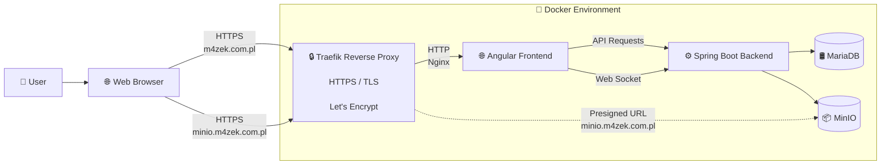

## 📅 Book Me Up


[](https://m4zek.com.pl)


**Book Me Up** is a full-stack appointment management platform designed to simplify the process of scheduling and managing visits between customers and service providers.

The application allows users to discover available services, create and manage appointments, communicate in real time, and manage their business profiles through an intuitive web interface.

The project was developed with a focus on **scalable architecture, security, maintainability, and production-like infrastructure**, using modern web technologies and containerized deployment.

The application is deployed on a VPS environment using Docker and is available as a live demo for testing without requiring local setup.

> 🚧 **Project Status: Alpha (0.0.1-ALPHA)**.<br> This version focuses on core features for end users (customers and business owners). Business management tools, an appointment scheduling system, real-time chat with users, user appointments management. Additional platform features will be introduced in future versions. <br> The current version of application is deployed and available on VPS: 👉 **[Visit Book Me Up (Live)](https://m4zek.com.pl)**

  
## 📌 Overview

The platform streamlines the entire booking process from discovering available services to scheduling appointments and communicating in real time.


- **👤 Customer Workflow**

  1. Register or sign in.
  2. Browse businesses and available services.
  3. Schedule an appointment.
  4. Manage upcoming and past reservations.
  5. Chat with other users (including business employees)
  6. Leave reviews for completed reservations

- **🏢 Service Provider Workflow**

  1. Create and manage a business profile.
  2. Add and organize offered services.
  3. Receive and manage customer appointments.
  4. Communicate with customers.
  5. Keep business information up to date.
  6. Hire new employees

- **🎯 Project Goals**

  - Simplify appointment scheduling.
  - Improve communication between customers and providers.
  - Provide a scalable architecture suitable for future expansion.
  - Demonstrate modern full-stack development practices.

- **⭐ Key Highlights**

  - Full-stack application built with Spring Boot and Angular
  - JWT/JWE authentication with role-based authorization
  - Real-time communication using WebSockets
  - Dockerized development and deployment
  - VPS deployment with production-like infrastructure
  - Object storage powered by MinIO
  - Company employee role-based access to management
  - And more..

## ✨ Features

- 👤 **User Management**
  - Account creation, authentication and role-based access
  - User profiles and reservation history

- 🏢 **Business Management**
  - Create and manage business profiles
  - Manage services, employees and business information

- 📅 **Appointment Scheduling**
  - Search businesses by name, location or category
  - Online booking with availability checking
  - Reservation management for users and businesses

- 💬 **Real-time Communication**
  - WebSocket-based messaging between users

- 📂 **Media Management**
  - Upload and manage business images
  - Object storage powered by MinIO

- 🔒 **Security**
  - Secure authentication and authorization
  - Protected API endpoints and role-based permissions
  

  **And there's probably more... Check out the [LIVE DEMO](https://m4zek.com.pl) and see for yourself!**

## 📅 Planned Features

  - 🔲 Administrator dashboard (Management users, companies. Management reports etc.)
  - 🔲 User management dashboard (User information, data management, etc.)
  - 🔲 System to reporting errors, irregularities, reviews, companies, etc.
  - 🔲 Real-time notifications (as is already the case with incoming messages)
  - 🔲 Email provider (notifications, password reset, account activation, etc.)
  - 🔲 System statistics (Companies, reservations, users, etc.)
  - 🔲 Security improvements (For obvious reasons, Won't say which ones)
  - And much more... 


## 🛠️ Tech Stack
  | Category | Technologies |
  |-----------|-------------|
  | Backend |   |
  | Frontend |  |
  | Database & Object Storage |   |
  | DevOps & Tools |    |
  

## 🚀 Deployment Architecture

The diagram below presents a simplified overview of the Book Me Up application architecture.

It shows the main components running in a Docker environment on a VPS and the communication flow between the frontend, backend, database, and storage services.

> ⚠️ This is only a conceptual diagram and may not represent all the details of the internal implementation.



## 💾 Local Installation and Setup (Docker)
  The project provides a complete Docker-based environment containing:

  - Spring Boot backend
  - Angular frontend
  - MariaDB database
  - MinIO object storage
  
  ### 1. Clone the repository

   ```bash
  git clone https://github.com/M4zek/book-me-up.git
  cd book-me-up
  ```
  
  ### 2. Build and start all services
  ```bash
  docker compose up --build --remove-orphans
  ```

  This command starts all required application services.
  > ⚠️ **Note:** The first build may take some time. Wait until all services are fully initialized before continuing.

  ### 3. Configure MinIO hostname
  > **Solves:** The problem of generating signed URLs for files in MinIO via the backend.<br>
  > **Note:** To allow your browser to resolve the MinIO hostname correctly in the local development environment, add the following entry to your system's hosts file:
  

  ```text
  127.0.0.1 minio
  ```

  - **🐧 Linux**

  Edit the hosts file with root privileges:

  ```bash
  sudo nano /etc/hosts
  ```
  If the following line does not yet exist, add it at the end:

  ```text
  127.0.0.1 minio
  ```
  - **🪟 Windows**

  Open **Notepad** as **Administrator**, then open:

  ```text
  C:\Windows\System32\drivers\etc\hosts
  ```

  Add the following line:

  ```text
  127.0.0.1 minio
  ```
  
  Save the file and exit.
  > **Note:** Administrator privileges are required to modify the hosts file.


  ### 4. Seed the database
  > **Note:** This will populate the database with the required initial or sample data.
  
  In a new terminal window, run:

  ```bash
  docker compose run --build --rm db-seed
  ```

  > ✅ Once you've completed Step 4, the app is ready to use: **[Book Me Up (Local)](http://localhost:4200)**

## 🧪 Test Accounts (Quick Access - Live Demo Only)
  To let you test the core features (including real-time chat) instantly without going through the registration process, you can use these pre-configured demo accounts:

  | Role | Email / Username | Password | Purpose |
  | :--- | :--- | :--- | :--- |
  | **Client A** | `client.john@example.com` | `Password123!` | Test booking services and sending chat messages |
  | **Business/Provider** | `service.alice@example.com` | `Password123!` | Test receiving bookings and replying to messages |

  ***Tip 1:** Open two different browser windows (e.g., standard and incognito) to log into both accounts simultaneously and test the real-time WebSocket chat between them!*

  ***Tip 2:** Search for a business by name: **Haircut & Nails** (it must be this specific business, because Alice is the owner), select an offer and make a reservation, then check the reservation in Alice’s dashboard—a new reservation for her business will appear there*

  ***Tip 3:** Browse through all the available tabs*

## 👨‍💻 Author 

  - Created with passion by **[M4zek](https://github.com/M4zek)**

## 📄 License

  This project was created for educational and portfolio purposes.

  It is not intended to be used as a production-ready commercial solution.

  This project is under the **[MIT License](https://mit-license.org/)**.


